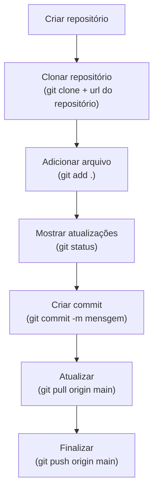
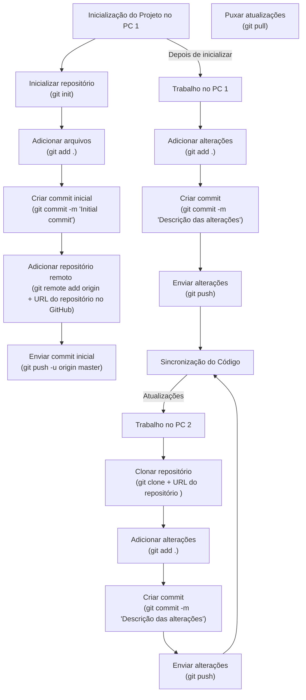
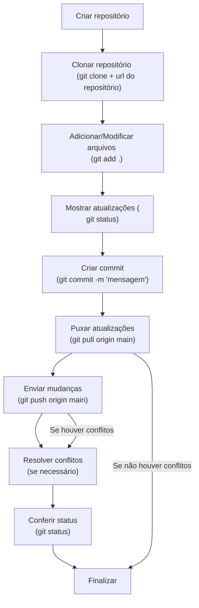

# git

## Comandos básicos


```bash
git clone
```

Serve para copiar o repositório, sem esse comando não 
é possível criar ou editar o seu repositório.*


*Adiciona o arquivo editado ou criado ao repositório. 
O git add ponto serve para salvar todos os arquivos da pasta existente no seu repositório.É necessário para preparar todas as alterações no diretório atual para o próximo commit, permitindo um controle organizado sobre as mudanças que serão incluídas.*

git add . 

git add (serve para adicionar arquivos específicos, mas é usado em poucos casos porque geralmente é o arquivo todo que é editado)

*Mostra as atualizações feitas, exibindo informações detalhadas sobre as alterações que foram feitas.
O git status é essencial para saber o que está acontecendo no seu repositório antes de fazer qualquer commit.*

git status

*Cria um commit com uma mensagem especificada, deixando registrado as alterações feitas no código.
 A mensagem descreve as mudanças feitas. Isso facilita no rastreamento do histórico do projeto feito.
 Sem esse comando as alterações feitas não são definitivamente salvas.*

git commit -m "mensagem"

*Atualiza o repositório local com as mudanças do branch principal (main) do repositório remoto (origin), obtendo essas atualizações, junta essas mudanças na branch local(main), mantendo o código atualizado e sincronizado.*  

git pull origin main


*Envia as atualizações para a branch principal (main).
 Esse comando transfere as alterações feitas localmente para o repositório compartilhado, mantendo  a sincronização do código.*
git push origin main

## Trabalhando sozinho em um computador




## Trabalhando sozinho em dois computadores



## Trabalhando em grupo em um computador cada um



## Comandos para trabalhar sozinho com 2 pcs

*Comandos para trabalhar sozinho com 2 pcs*

*Inicio do Projeto no PC 1*

* Começa um novo repositório Git no diretório atual. Cria uma pasta oculta chamada .git, onde o Git guarda informações sobre o histórico do projeto e rastreia todas as alterações feitas.*

git init

*Adiciona o arquivo editado ou criado ao repositório. 
O git add ponto serve para salvar todos os arquivos da pasta existente no seu repositório.É necessário para preparar todas as alterações no diretório atual para o próximo commit, permitindo um controle organizado sobre as mudanças que serão incluídas.*

git add . 

git add (serve para adicionar arquivos específicos, mas é usado em poucos casos porque geralmente é o arquivo todo que é editado)

* Salva as mudanças selecionadas com uma mensagem descritiva ("Initial commit"), criando um ponto de recuperação no histórico do projeto criado.*

git commit -m "Initial commit"

 *Conecta o repositório local a um repositório remoto no GitHub (ou outro serviço), permitindo que envie (push) e receba (pull) mudanças*

git remote add origin + URL do repositório 

*Transfere o commit inicial salvo localmente para o repositório remoto na branch (linha de desenvolvimento) chamada master. O -u define origin como o padrão para futuros envios.*

git push -u origin master

*APLICAÇÃO NO PC 1*

*Adiciona o arquivo editado ou criado ao repositório. 
O git add ponto serve para salvar todos os arquivos da pasta existente no seu repositório.É necessário para preparar todas as alterações no diretório atual para o próximo commit, permitindo um controle organizado sobre as mudanças que serão incluídas.*

git add . 

git add (serve para adicionar arquivos específicos, mas é usado em poucos casos porque geralmente é o arquivo todo que é editado)

*Mostra as atualizações feitas, exibindo informações detalhadas sobre as alterações que foram feitas.
O git status é essencial para saber o que está acontecendo no seu repositório antes de fazer qualquer commit.*

git status

*Cria um commit com uma mensagem especificada, deixando registrado as alterações feitas no código.
 A mensagem descreve as mudanças feitas. Isso facilita no rastreamento do histórico do projeto feito.
 Sem esse comando as alterações feitas não são definitivamente salvas.*

git commit -m "mensagem"


*Envia as atualizações para a branch principal (main).
 Esse comando transfere as alterações feitas localmente
  para o repositório compartilhado, mantendo  a sincronização do código.*

git push origin main


*NO PC 2*

*Serve para copiar o repositório, sem esse comando não 
é possível criar ou editar o seu repositório.*

git clone + URL do repositório

*Adiciona o arquivo editado ou criado ao repositório. 
O git add ponto serve para salvar todos os arquivos da pasta existente no seu repositório.É necessário para preparar todas as alterações no diretório atual para o próximo commit, permitindo um controle organizado sobre as mudanças que serão incluídas.*

git add . 

git add (serve para adicionar arquivos específicos, mas é usado em poucos casos porque geralmente é o arquivo todo que é editado)

* Salva as mudanças selecionadas com uma mensagem descritiva.*

git commit -m "mensagem"


*Envia as mudanças para o GitHub.*

git push

*Baixa e incorpora as atualizações feitas*
git pull

